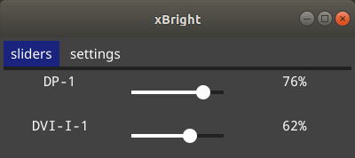
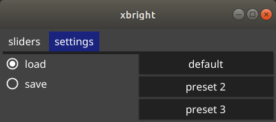

# xBright

A simple tool to edit your display's brightness.
Works for most Linux systems such as Debian based (Ubuntu, Mint), Red Hat based (CentOS, fedora), Arch, and others.
Any system were [`xrandr`](https://wiki.archlinux.org/index.php/Xrandr) works.

## Screenshots

Inspired by [https://github.com/LordAmit/Brightness](https://github.com/LordAmit/Brightness)
