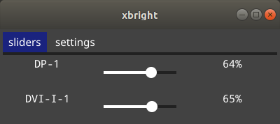

# xBright

A simple tool to edit your display's brightness.
Works for systems that [`xrandr`](https://wiki.archlinux.org/index.php/Xrandr) works on.

## Screenshots

Inspired by [https://github.com/LordAmit/Brightness](https://github.com/LordAmit/Brightness)
